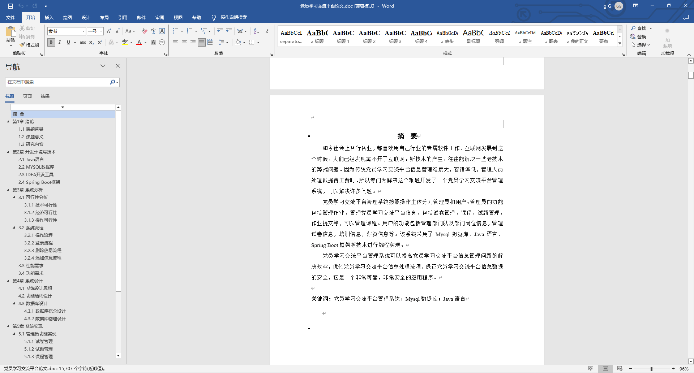
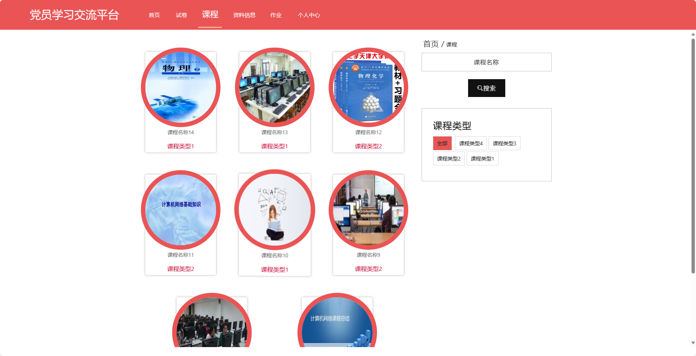
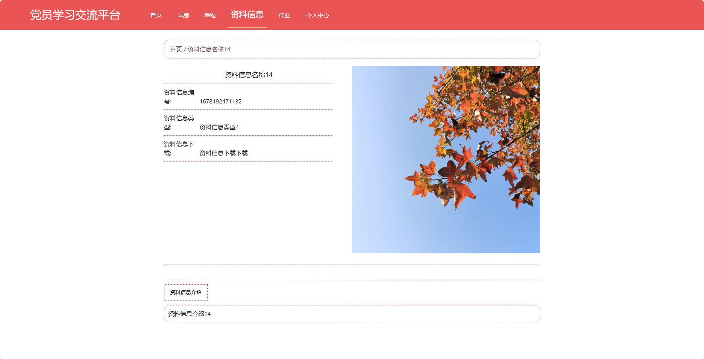
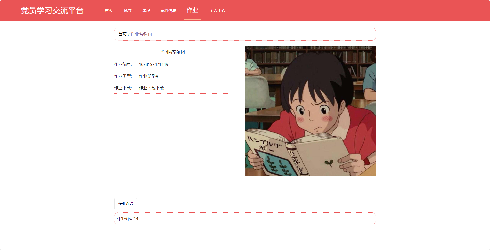
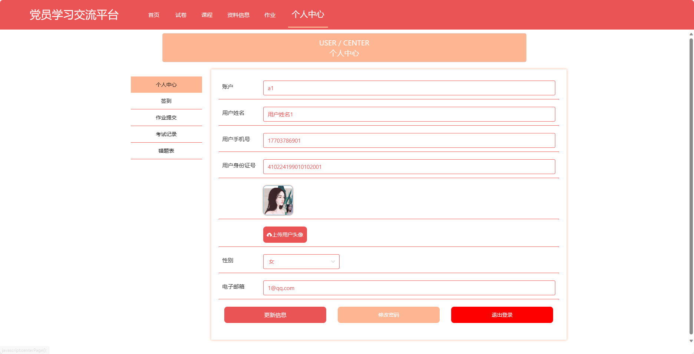

## 基于SpringBoot的党员学习交流平台(程序+报告)

###  获取sql数据库文件: 从戎源码网 (https://armycodes.com/) QQ: 386869957 QQ群: 377586148
###  所有系统地址: (https://github.com/YuLin-Coder/AllProjectCatalog) 
###  所有项目以及源代码本人均调试运行无问题 可支持远程安装部署调试、定制修改、代码讲解

## 项目介绍
基于SpringBoot的党员学习交流平台，系统包含两种角色：管理员、用户,系统分为前台和后台两大模块，主要功能如下。

### 【管理员】:
- 个人中心：管理个人信息和账户。
- 管理员管理：管理系统管理员账号，包括新增、编辑、删除管理员账号。
- 老师管理：管理教师账号，包括新增、编辑、删除教师账号。
- 用户管理：管理用户账号，包括查看用户列表、禁用用户账号等操作。
- 试卷管理：管理试卷的信息，包括新增、编辑、删除试卷以及设置试卷属性。
- 试题管理：管理试题的信息，包括新增、编辑、删除试题以及试题分类。
- 考试管理：管理考试的信息，包括发布考试、查看考试成绩等操作。
- 作业管理：管理作业的信息，包括新增、编辑、删除作业以及设置截止日期。
- 作业提交管理：查看学生的作业提交情况，包括批改作业、评分等操作。
- 课程管理：管理课程的信息，包括新增、编辑、删除课程以及发布课程资料。
- 签到管理：管理学员的签到情况，包括查看签到记录和统计签到率等操作。
- 资料信息管理：管理学习资料和文献资源的信息，包括新增、编辑、删除资料信息。
- 基础数据管理：管理系统的基础数据，例如试卷分类、课程分类等信息。
- 轮播图信息：管理首页轮播图的展示，包括新增、编辑、删除轮播图信息。

### 【老师】:
- 个人中心：管理个人信息和账户。
- 用户管理：查看学员账号列表和信息。
- 试卷管理：管理试卷的信息，包括新增、编辑、删除试卷以及设置试卷属性。
- 试题管理：管理试题的信息，包括新增、编辑、删除试题以及试题分类。
- 考试管理：管理考试的信息，包括发布考试、查看考试成绩等操作。
- 作业管理：管理作业的信息，包括新增、编辑、删除作业以及设置截止日期。
- 作业提交管理：查看学生的作业提交情况，包括批改作业、评分等操作。
- 课程管理：管理课程的信息，包括新增、编辑、删除课程以及发布课程资料。
- 签到管理：管理学员的签到情况，包括查看签到记录和统计签到率等操作。
- 资料信息管理：管理学习资料和文献资源的信息，包括新增、编辑、删除资料信息。

### 【前台】:
- 首页：展示平台的概况、最新资讯等内容。
- 试卷：提供在线考试的试卷和答题功能。
- 课程：提供在线学习的课程和视频资料。
- 资料信息：展示各类学习资料和文献资源。
- 作业：发布和提交学习作业，并提供批改和评分功能。
- 个人中心：用户可以管理个人信息。

## 项目技术
- 编程语言：Java
- 数据库：MySQL
- 项目管理工具：Maven
- 前端技术：HTML、CSS、JavaScript、Jquery、Vue
- 后端技术：Spring、SpringMVC、MyBatis

## 运行环境
- JDK版本：JDK1.8及以上
- 开发工具：IDEA、Ecplise、Myecplise都可以
- 数据库: MySQL5.7及以上
- Maven：maven3.0及以上
- Node：14.14.0及以上

## 运行截图

